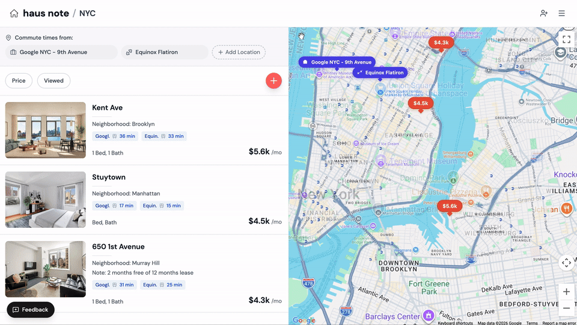
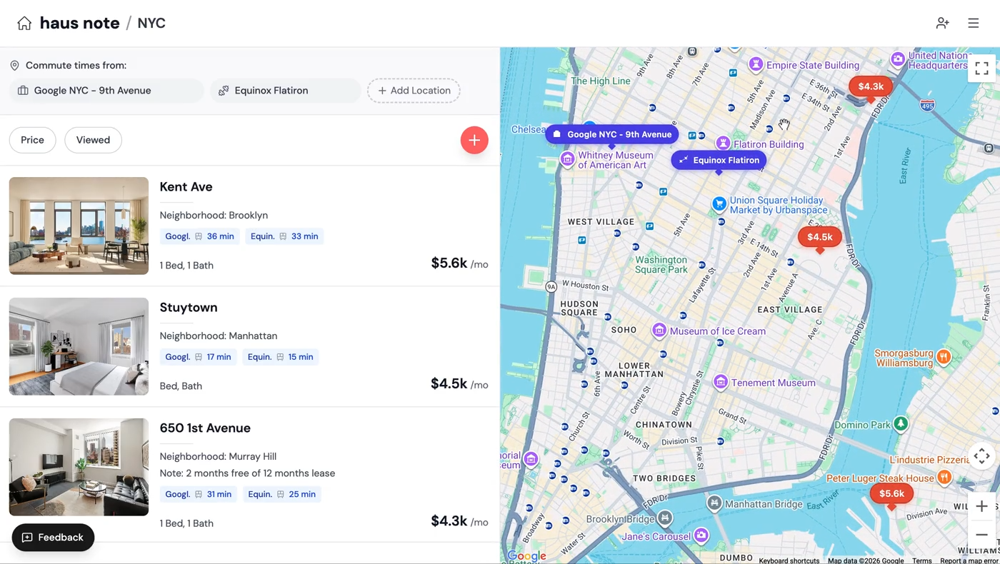

# Haus Note

**Collaborative apartment hunting for couples and roommates.**

[](https://hausnote.app)



---

## The Problem

Apartment hunting with a partner or roommates is chaos:
- Spreadsheets with 50 columns nobody updates
- Screenshots scattered across phones
- "Which one had the nice kitchen again?"
- Manually checking commute times for every listing

## The Solution

Haus Note keeps everything in one place. Save apartments, upload photos from tours, see everything on a map, and hunt together in real-time.

---

## Features

| Feature | Description |
|---------|-------------|
| **Project-Based Organization** | Create separate searches (e.g., "NYC Fall 2026") with budget and move-in date |
| **Smart Map View** | All apartments on an interactive Google Map with price markers |
| **Auto Commute Times** | Add work/school locations once, get commute times for every apartment automatically |
| **Media Uploads** | Photos and videos per apartment with gallery view |
| **Real-Time Collaboration** | Invite partners/roommates as owners, editors, or viewers |
| **Status Pipeline** | Track apartments: Interested → Visited → Applied → Accepted |
| **Amenity Tracking** | 12 preset amenities + custom ones with one-click toggles |
| **Comments** | Discuss apartments with your team |



---

## Tech Stack

```
┌─────────────────────────────────────────────────────────────┐
│                        Frontend                             │
│  React 19 · TypeScript · Tailwind CSS · React Router v7     │
├─────────────────────────────────────────────────────────────┤
│                        Backend                              │
│  Supabase (PostgreSQL · Auth · Row-Level Security · Storage)│
├─────────────────────────────────────────────────────────────┤
│                     External APIs                           │
│  Google Maps · Geocoding API · Distance Matrix API          │
├─────────────────────────────────────────────────────────────┤
│                        Mobile                               │
│  Capacitor (iOS / Android native shell)                     │
└─────────────────────────────────────────────────────────────┘
```

---

## Architecture

```
src/
├── pages/           # Route-level components
│   ├── AuthPage.tsx           # Login/signup with Supabase Auth
│   ├── ProjectDashboard.tsx   # User's project list
│   ├── ProjectPage.tsx        # Main app (list + map split view)
│   └── InvitePage.tsx         # Invitation acceptance flow
│
├── components/      # Reusable UI (15+ components)
│   ├── ApartmentDetail.tsx    # Full detail modal
│   ├── ApartmentMap.tsx       # Google Maps integration
│   ├── MediaUploader.tsx      # Drag-and-drop uploads
│   ├── CommuteLocations.tsx   # Manage commute destinations
│   └── ...
│
├── services/        # API layer (one file per domain)
│   ├── apartmentService.ts    # CRUD apartments, comments, amenities
│   ├── mediaService.ts        # Supabase Storage uploads
│   ├── projectService.ts      # Projects, members, invitations
│   ├── commuteService.ts      # Google Distance Matrix
│   └── geocodeService.ts      # Address → coordinates
│
└── types/           # TypeScript interfaces matching DB schema
```

---

## Database Design

**10 tables** with Row-Level Security policies for multi-tenant isolation:

- `projects` — Search projects with city, budget, move-in date
- `project_members` — Role-based access (owner/editor/viewer)
- `project_invitations` — Secure token-based email invites (7-day expiry)
- `apartments` — Listings with address, price, coordinates, status, rating
- `apartment_media` — Photos/videos in Supabase Storage
- `apartment_comments` — Threaded discussions
- `amenities` — Per-apartment amenity tracking
- `commute_locations` — Project-level destinations
- `apartment_commutes` — Cached commute durations (4 travel modes)
- `activity_logs` — Full audit trail

---

## Key Technical Decisions

| Decision | Rationale |
|----------|-----------|
| **Supabase RLS** | Server-side security enforcement; clients can't bypass permissions |
| **Computed media URLs** | Store `storage_path`, resolve public URLs at fetch time for flexibility |
| **Geocoding on blur** | Address → coordinates happens as user types, with retry on submit |
| **Background commute calculation** | Non-blocking; calculates all modes for all destinations after apartment creation |
| **Capacitor for mobile** | Single codebase for web + iOS + Android with native shell |

---

## Local Development

```bash
# Clone and install
git clone https://github.com/Soojin-Lee0819/haus-note.git
cd haus-note
npm install

# Configure environment
cp .env.example .env
# Add your Supabase and Google Maps API keys

# Run
npm start
```

**Requirements:**
- Node.js 18+
- [Supabase](https://supabase.com) project
- [Google Maps API key](https://developers.google.com/maps/documentation/javascript/get-api-key) (Maps, Geocoding, Distance Matrix)

---

## Mobile Build

```bash
# iOS (requires Xcode)
npm run cap:ios

# Android (requires Android Studio)
npm run cap:android
```

---

## License

ISC
